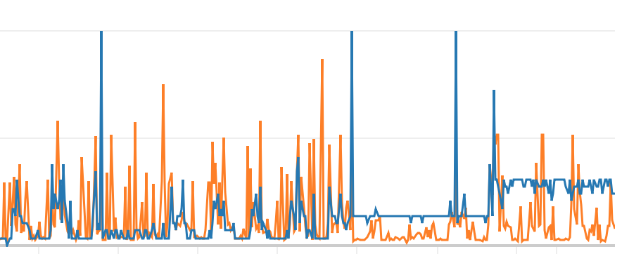

# Warmer

Keeps Lambdas warm by executing them on a periodic basis using an API Gateway request.

Since it doesn't traverse the API Gateway, any cold start penalty incurred by triggering the Lambdas using
the AWS SDK isn't part of the API Gateway integration latency, leaving API Gateway metrics as an accurate
reflection of what end users saw.

The spinner directory contains a suitable middleware handler which also returns the ID of the running Lambda, and its duration. However, you can use any endpoint.

These are logged to CloudWatch in JSON format, which allows for Lambda lifespan to be measured by extracting values from the logs with CloudWatch Metric extractors.

# Latency vs Configuration



The blue line here is concurrency. The orange line is the latency.

You can see when the warmer was applied when the blue line goes flat. It's configured to warm 5 lambdas initially.

A few days later, the warmer was configured to 10 lambdas which negated some of the benefits. The Lambda RAM was also increased which had a negative impact on the runtime of the containers.

# Usage

Create a `config.yml` file:

```yaml
environment:
  LAMBDA_0_FUNCTION: my-function-dev
  LAMBDA_0_PATH: /spin
  LAMBDA_0_COUNT: 1
  LAMBDA_1_FUNCTION: my-function-uat
  LAMBDA_1_PATH: /spin
  LAMBDA_1_COUNT: 5
iamRoleStatements:
- Effect: "Allow"
  Action:
    - "lambda:InvokeFunction"
  Resource: arn:aws:lambda:eu-west-1:123264324673:function:my-function-dev
- Effect: "Allow"
  Action:
    - "lambda:InvokeFunction"
  Resource: arn:aws:lambda:eu-west-1:123264324673:function:my-function-prod
```
